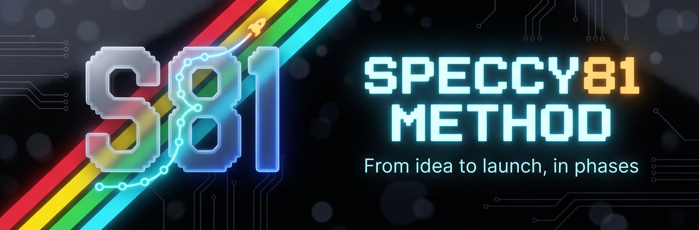

# Speccy81 Method



**From idea to launch.** A method by LV-Webstudio (Speccy81) for setting up any project — product, service, module or app — with the same rigour: research first, decide with data, turn what you learn into verified knowledge, audit it, design before coding, test in the field and publish without surprises. It comes in two editions built from the same method, each one a Claude Code plugin marketplace.

This is the **basic edition**: free and public, with a skill, a short guide and 8 templates in each language.

**Languages · Idiomas:** [English](README.md) · [Español](README.es.md) · [Català](README.ca.md) · [Nederlands](README.nl.md) · [Polski](README.pl.md) · [Português](README.pt.md) · [Français](README.fr.md) · [Italiano](README.it.md) · [Deutsch](README.de.md)

## Editions

| | Basic | Complete |
|---|---|---|
| Licence | Public: CC BY 4.0 (guide, SKILL and templates) + MIT (scripts); see `NOTICE` | Proprietary, LV-Webstudio |
| Path | A five-step light path for extensions and small projects | Phases 0–9 plus 8 bis |
| Templates | 8 (01, 06, 09, 10, 13, 15, 20 and 21) | 21 |
| Golden rules | The 13, in short form | The 13 in full, plus the efficiency improvements E1–E15 |
| Research and audit | — | Parallel research waves and a single audit |
| Knowledge validator | — | Yes |
| Deployment and launch | — | Deployment and QA on another device, and publication |
| Governance and security | Rule 13 in short form, «Proof:» on every result, incidents (20) and accountability (21) | Plus: governance of several machines (19), moving a secret and rotating an exposed key |
| Several machines | A single session or machine; for several sessions with minimal rules, Wassup Basic | Full governance and optional coordination with Wassup |

## The five steps

| Step | What happens | Template |
|---|---|---|
| 1 · Phase 0 | Context sheet; if the project is already under way, record what exists (code, documents, decisions) | 01 |
| 2 | Gap checklist and canonical facts, before researching or designing | 06, 10 |
| 3 · Phase 7 | Short design, approved by the user before coding | 09 |
| 4 · Phase 8 | Build with real and field tests | 13 |
| 5 | Idempotent memory at the close of each step | 15 |
| Always | Accountability with «Proof:» at the close of each task; incident if a key or datum is exposed | 21, 20 |

The phase numbers (0, 7 and 8) are those of the complete method, so a project can grow without renumbering anything. The complete edition adds the rest: phases 1 to 6, 8 bis and 9.

## What is inside

One plugin per language, each with the skill, the guide and the 8 templates: `speccy81-method` (English), `metodo-speccy81` (Español), `metode-speccy81-ca` (Català), `metodo-speccy81-pt` (Português), `methode-speccy81-fr` (Français), `metodo-speccy81-it` (Italiano), `speccy81-methode-de` (Deutsch), `speccy81-methode-nl` (Nederlands) and `metoda-speccy81-pl` (Polski).

All plugins carry the same method; install the one in the language you prefer.

## Install

```
claude plugin marketplace add LV-webstudio/speccy81
claude plugin install speccy81-method@speccy81      # English
claude plugin install metodo-speccy81@speccy81      # Español
claude plugin install metode-speccy81-ca@speccy81   # Català
claude plugin install metodo-speccy81-pt@speccy81   # Português
claude plugin install methode-speccy81-fr@speccy81  # Français
claude plugin install metodo-speccy81-it@speccy81   # Italiano
claude plugin install speccy81-methode-de@speccy81  # Deutsch
claude plugin install speccy81-methode-nl@speccy81  # Nederlands
claude plugin install metoda-speccy81-pl@speccy81   # Polski
```

Then ask Claude Code to "apply the Speccy81 method", also for a project that is already under way. The skill loads the guide and the templates on demand.

[Wassup](https://github.com/LV-webstudio/wassup) is an optional companion when several machines or sessions work on the same project.

## How to get the complete edition

The complete edition is licensed by LV-Webstudio. Request access through [lv-webstudio.com](https://lv-webstudio.com/).

## License

The basic edition is offered under two licences: **CC BY 4.0** for the guide, SKILL.md and templates (free use, including commercial use, with attribution) and **MIT** for scripts and code. Suggested attribution: «Método Speccy81 · LV-Webstudio · lv-webstudio.com». The complete edition is not covered by these licences. See [LICENSE](LICENSE).
